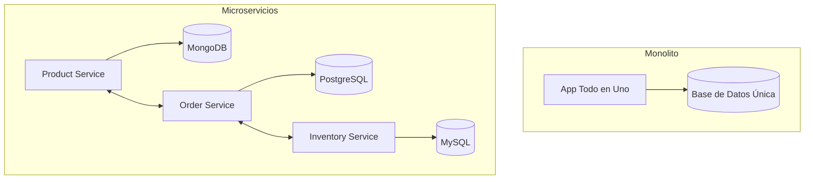
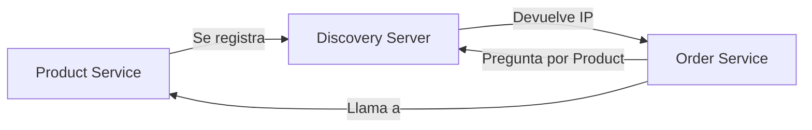
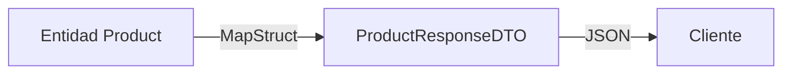
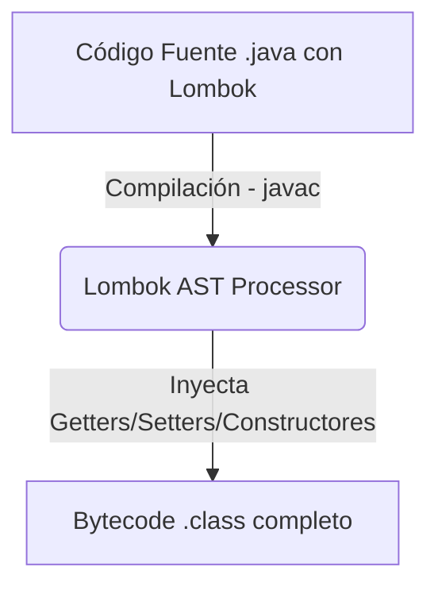
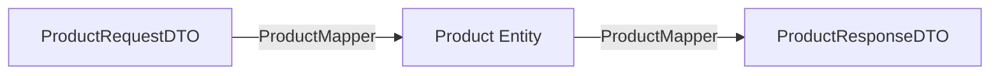

# Conceptos Teóricos de Microservicios

Este documento explica los fundamentos de la arquitectura de microservicios aplicada en este proyecto, diseñado como un recurso de aprendizaje.

## 1. ¿Qué son los Microservicios?

A diferencia de una arquitectura monolítica (donde todo el código está en una sola aplicación), los microservicios dividen la aplicación en pequeños servicios independientes que se comunican entre sí.

### Monolito vs. Microservicios



---

## 2. Service Discovery (Eureka)

En un entorno de microservicios, los servicios cambian sus direcciones IP constantemente (especialmente en la nube o contenedores). El **Discovery Server** actúa como una "guía telefónica".

- **Registro**: Cuando un servicio arranca, le dice al Discovery Server: "Hola, soy el Product Service y mi dirección es 192.168.1.10".
- **Descubrimiento**: Cuando el Order Service necesita llamar al Product Service, le pregunta al Discovery Server: "¿Dónde está el Product Service?".



---

## 3. Patrón DTO (Data Transfer Object)

No es buena práctica exponer nuestras entidades de base de datos directamente a la API. Usamos **DTOs** para:
- Filtrar información sensible.
- Desacoplar la API del esquema de la base de datos.
- Mejorar el rendimiento enviando solo lo necesario.



---

## 4. Virtual Threads (Java 21)

Este proyecto habilita `spring.threads.virtual.enabled: true`. 
Los **Virtual Threads** (Hilos Virtuales) permiten manejar miles de peticiones simultáneas con muy poco consumo de memoria, a diferencia de los hilos tradicionales de la plataforma que son pesados.

---

## 5. Persistencia Políglota

Cada microservicio elige la base de datos que mejor se adapta a sus necesidades:
- **Product Service**: MongoDB (NoSQL) porque el catálogo de productos puede tener atributos muy variables y no estructurados.
- **Order Service**: PostgreSQL (Relacional) porque las órdenes requieren transacciones ACID estrictas.
- **Inventory Service**: MySQL (Relacional) para un control de stock preciso.

---

## 6. Docker y Orquestación

Docker nos permite empaquetar cada servicio con todas sus dependencias. El archivo `docker-compose.yml` en la raíz coordina el arranque de todas las bases de datos y servicios, asegurando que todos funcionen de manera idéntica en cualquier computadora.

---

## 7. Guía de Librerías y Anotaciones (Enfoque Práctico)

Para mantener el código limpio y profesional, utilizamos varias librerías que automatizan el trabajo repetitivo. A continuación, te explicamos cómo funcionan dentro del proyecto.

### A. Lombok: Automatización de Código "Boilerplate"

Lombok evita que escribamos manualmente Getters, Setters, Constructores y otros métodos comunes. Se ejecuta durante la fase de compilación del código.



#### Anotaciones utilizadas en `Product.java` y `ProductServiceImpl.java`:

1.  **`@Data`**
    *   **¿Qué hace?** Es un "combo" que genera automáticamente: `@Getter`, `@Setter`, `@ToString`, `@EqualsAndHashCode` y `@RequiredArgsConstructor`.
    *   **Ejemplo didáctico**:
        ```java
        // Con Lombok
        @Data
        public class Persona { private String name; }

        // Lo que genera por debajo en el .class:
        public class Persona {
            private String name;
            public String getName() { return this.name; }
            public void setName(String name) { this.name = name; }
            // toString, equals, hashCode...
        }
        ```

2.  **`@AllArgsConstructor`**
    *   **¿Qué hace?** Genera un constructor con todos los atributos de la clase como parámetros.
    *   **¿Por qué se usa?** Es muy útil cuando queremos instanciar un objeto pasando todos los campos o cuando usamos el patrón Builder.

3.  **`@NoArgsConstructor`**
    *   **¿Qué hace?** Genera un constructor vacío (sin parámetros).
    *   **¿Por qué se usa?** **MongoDB** (y otros frameworks como Hibernate) necesita un constructor sin argumentos para poder recrear la clase desde la base de datos usando Java Reflection.

4.  **`@Builder` (Patrón de Diseño Constructor)**
    *   **¿Qué hace?** Genera una API fluida para construir objetos sin tener que llamar a constructores complejos o usar múltiples Setters.
    *   **Ejemplo didáctico**:
        ```java
        // Sin @Builder:
        Product product = new Product("1", "Laptop", "Es una laptop", new BigDecimal("1200"));

        // Con @Builder (más legible y flexible):
        Product product = Product.builder()
                                 .name("Laptop")
                                 .price(new BigDecimal("1200"))
                                 .description("Es una laptop")
                                 .build();
        ```

5.  **`@RequiredArgsConstructor` (Inyección de Dependencias)**
    *   **¿Qué hace?** Genera un constructor únicamente para los campos declarados como `final`.
    *   **¿Por qué se usa?** Es la **mejor práctica en Spring** para realizar inyección de dependencias por constructor sin usar la anotación `@Autowired`.
    *   **En nuestro código (`ProductController.java`)**:
        ```java
        @RestController
        @RequiredArgsConstructor
        public class ProductController {
            private final ProductService productService; // Se inyecta automáticamente gracias al constructor generado por Lombok
        }
        ```

6.  **`@Slf4j` (Logging)**
    *   **¿Qué hace?** Inyecta una variable estática llamada `log` para imprimir logs en consola.
    *   **Ejemplo**: `log.info("Producto {} creado", savedProduct.getName());` en `ProductServiceImpl.java`.

---

### B. Spring Data MongoDB: Persistencia NoSQL

Para conectar nuestra entidad Java con MongoDB, utilizamos anotaciones del ecosistema Spring Data MongoDB:

1.  **`@Document(value="product")`**
    *   Indica que la clase representa un documento NoSQL que se guardará en la colección llamada `"product"` dentro de MongoDB. Es el equivalente a `@Table` en bases de datos relacionales.
2.  **`@Id`**
    *   Marca el campo correspondiente como la clave primaria del documento. MongoDB generará un identificador único (ObjectId) si no se le provee uno.

---

### C. MapStruct: Mapeo de Objetos Veloz y Seguro

**MapStruct** se encarga de convertir de DTO a Entidad y viceversa. A diferencia de otras librerías como *ModelMapper* (que usan Reflection lento en tiempo de ejecución), MapStruct **genera código Java puro durante la compilación**, lo que lo hace increíblemente rápido.



#### En nuestro mapeador `ProductMapper.java`:

1.  **`@Mapper(componentModel = "spring")`**
    *   Indica que es un mapeador de MapStruct y que debe registrarse como un componente de Spring (`@Component`) para poder inyectarlo en nuestros servicios con `@Autowired` o por constructor.
2.  **`@Mapping(target = "id", ignore = true)`**
    *   Le dice a MapStruct: "No intentes mapear el atributo `id`". Esto es muy útil al crear un producto, ya que el DTO de entrada (`ProductRequestDTO`) no viene con un `id` (lo genera la base de datos).
3.  **`@MappingTarget` (Actualización de registros)**
    *   Se utiliza para mapear y actualizar un objeto existente con nuevos datos.
    *   **En nuestro código**:
        ```java
        void updateProductFromRequest(ProductRequestDTO productRequest, @MappingTarget Product product);
        ```
        Aquí, MapStruct modificará los campos del objeto `product` directamente usando los valores dentro de `productRequest`, preservando los campos que no se actualizaron (como el `id`).

---

### D. Jakarta Validation: Integridad de Datos

Para que datos inválidos no lleguen a nuestra base de datos, aplicamos validaciones en los DTOs usando la API de validación oficial de Java:

*   **`@NotBlank`**: Verifica que el campo de texto no sea nulo y no esté vacío ni lleno de puros espacios.
*   **`@NotNull`**: Garantiza que el campo no sea nulo.
*   **`@Positive`**: Asegura que un número sea estrictamente mayor a 0 (ideal para precios).

**¿Cómo se activa?** Añadiendo `@Valid` en la firma de nuestros controladores:
```java
public ProductResponseDTO createProduct(@RequestBody @Valid ProductRequestDTO productRequestDTO) { ... }
```

---

### E. Clases Estándar vs. Java Records

En el proyecto notarás una decisión arquitectónica clave:
*   `Product.java` es una **Clase Estándar** con Lombok.
*   `ProductRequestDTO.java` es un **Java Record** (`public record ProductRequestDTO(...)`).

#### ¿Por qué?

| Característica | Clase Estándar (Product) | Java Record (ProductRequestDTO) |
| :--- | :--- | :--- |
| **Mutabilidad** | Mutable (los campos pueden cambiar de valor). | **Inmutable** (una vez creado, no cambia de valor). |
| **Uso Ideal** | Entidades de Base de Datos (necesitan ser modificadas). | **DTOs / Datos de Paso** (solo transportan información). |
| **Código repetitivo** | Requiere Lombok (`@Data`) para no escribir boilerplate. | Genera de forma nativa e implícita getters, constructor, equals y toString. |
