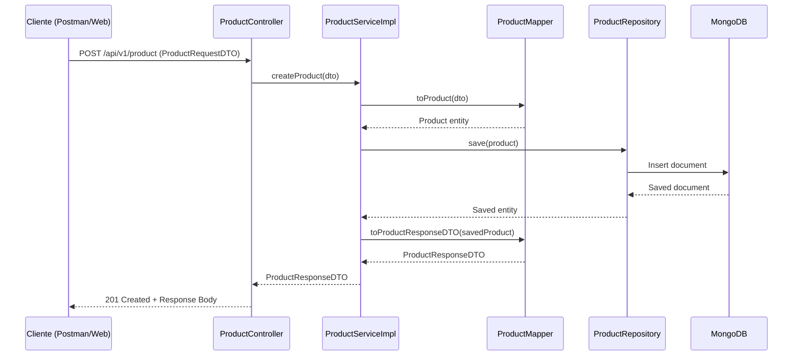

# Documentación de Product Service

El `product-service` es un microservicio fundamental en nuestra arquitectura de e-commerce. Se encarga de la gestión del catálogo de productos, permitiendo operaciones CRUD (Crear, Leer, Actualizar, Borrar) sobre los productos.

## Tecnologías Utilizadas

- **Java 21**: Utiliza las últimas características de Java, incluyendo **Virtual Threads** para una mejor escalabilidad.
- **Spring Boot 4.1.0**: Framework principal para el desarrollo del microservicio.
- **Spring Data MongoDB**: Para la persistencia de datos en una base de datos NoSQL.
- **MongoDB**: Base de datos orientada a documentos, ideal para catálogos de productos flexibles.
- **MapStruct**: Para el mapeo eficiente entre Entidades y DTOs.
- **Lombok**: Para reducir el código repetitivo (Boilerplate).
- **Docker**: Para la contenedorización del servicio y la base de datos.

## Arquitectura del Servicio

El servicio sigue una arquitectura por capas:

1. **Controller**: Maneja las peticiones HTTP externas.
2. **Service**: Contiene la lógica de negocio.
3. **Repository**: Se comunica con la base de datos MongoDB.
4. **Model/Entity**: Representa la estructura de los datos en la base de datos.
5. **DTO**: Objetos de transferencia de datos para la API.

### Diagrama de Flujo (Creación de Producto)



## API Endpoints

| Método | Endpoint | Descripción |
| :--- | :--- | :--- |
| `POST` | `/api/v1/product` | Crea un nuevo producto. |
| `GET` | `/api/v1/product` | Obtiene la lista de todos los productos. |
| `GET` | `/api/v1/product/{id}` | Obtiene un producto por su ID. |
| `PUT` | `/api/v1/product/{id}` | Actualiza un producto existente. |
| `DELETE` | `/api/v1/product/{id}` | Elimina un producto. |

## Modelo de Datos

El microservicio utiliza MongoDB. El documento `product` tiene la siguiente estructura:

```json
{
  "_id": "String",
  "name": "String",
  "description": "String",
  "price": "BigDecimal"
}
```

## Configuración y Ejecución

El servicio está configurado para ejecutarse en el puerto `8080`. Se puede configurar mediante variables de entorno en Docker:

- `MONGO_HOST`: Host de MongoDB (default: localhost).
- `MONGO_PORT`: Puerto de MongoDB (default: 27017).
- `MONGO_DATABASE`: Nombre de la base de datos (default: product-db).
